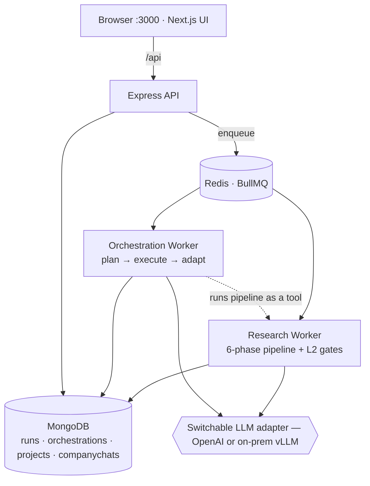
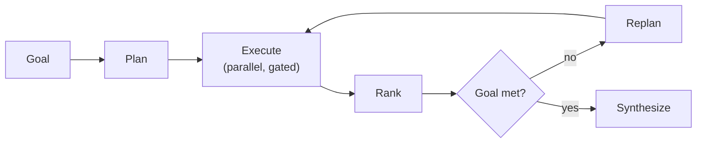

# ProspectIQ

> Evidence-grounded lead research and personalized pitch generation, powered by a 6-phase multi-agent AI pipeline.

One input (URL, name, or company) → 6 AI phases → grounded prospect profile + personalized pitch, auto-reviewed by a critic agent.

---

## What It Does

Most cold outreach fails because research is shallow and pitches are generic. ProspectIQ fixes both:

- **4 research agents run in parallel** — web scraping, LinkedIn, news, YouTube
- **Every claim is verified** with a verbatim source quote before it enters the profile
- **Service matching** ranks your catalog against the prospect's real signals
- **Critic agent reviews and auto-revises** the pitch before you ever see it

The result: a fully sourced prospect profile + a personalized pitch in under 5 minutes, grounded in real evidence rather than guesswork.

---

## Architecture

> 📐 **Full reference:** [`docs/ARCHITECTURE.md`](docs/ARCHITECTURE.md) — the complete architecture, the
> loop stack, process topology, data model, and every end-to-end flow.

ProspectIQ is built as a **stack of loops** — the original 6-phase pipeline (Loop 1), wrapped in
verification gates (Loop 2), driven by a dynamic goal orchestrator (Loop 1.5), plus a Projects workspace
for organizing, reusing, and chatting over research.



The dynamic orchestrator's adaptive loop:



<details><summary>Core 6-phase pipeline (detailed ASCII view)</summary>

```
┌──────────────────────────────────────────────────────────┐
│                   ProspectIQ System                      │
│                                                          │
│  Next.js Frontend  ──────────►  Express API (port 3001) │
│  (port 3000)                         │                   │
│                                      │ enqueue           │
│                              BullMQ + Redis              │
│                                      │ dequeue           │
│                               Worker Process             │
│                                      │                   │
│                          ProspectOrchestrator            │
│                                      │                   │
│       ┌──────────────────────────────▼──────────────┐   │
│       │              6-Phase Pipeline                │   │
│       │                                              │   │
│       │  1. Research ──► 4 agents in parallel        │   │
│       │     │  Website · LinkedIn · News · YouTube   │   │
│       │     ▼                                        │   │
│       │  2. Verification ──► verbatim source quotes  │   │
│       │     ▼                                        │   │
│       │  3. Synthesis ──► Think → Act (structured)   │   │
│       │     ▼                                        │   │
│       │  4. Matching ──► service catalog ranking     │   │
│       │     ▼                                        │   │
│       │  5. Pitch ──► channel-specific outreach      │   │
│       │     ▼                                        │   │
│       │  6. Reflection ──► critic → auto-revise      │   │
│       └──────────────────────────────────────────────┘   │
│                                      │                   │
│                                   MongoDB                │
│                          (run persistence + events)      │
└──────────────────────────────────────────────────────────┘
```

</details>

### Real-time Streaming

Pipeline progress streams to the frontend via **Server-Sent Events (SSE)**. Each phase start, agent completion, and run status change is pushed live — no polling.

---

## Pipeline Phases

| # | Phase | What happens |
|---|-------|-------------|
| 1 | **Research** | 4 agents run in parallel: website scraper, LinkedIn parser, news search, YouTube channel analysis |
| 2 | **Verification** | Every factual claim is cross-checked and tagged with a verbatim quote from the source |
| 3 | **Synthesis** | Think-before-act: LLM reasons about evidence first, then produces a structured `ProspectProfile` with signals, pain points, and opportunities |
| 4 | **Matching** | Your service catalog is ranked against the verified signals using semantic scoring |
| 5 | **Pitch** | Channel-specific outreach (email / LinkedIn DM / Twitter) tied to real evidence from the profile |
| 6 | **Reflection** | A critic agent scores the pitch quality (0–100). If below threshold (default 70), it revises and improves the pitch |

---

## Tech Stack

| Layer | Technology |
|-------|-----------|
| Frontend | Next.js 14 (App Router), Tailwind CSS, TypeScript |
| Backend | Node.js, Express, TypeScript, ts-node |
| Queue | BullMQ + Redis |
| Database | MongoDB (Mongoose) |
| LLM | OpenAI / Anthropic / Local vLLM (unified adapter) |
| Streaming | Server-Sent Events (SSE) |
| Research | Web scraping, SerpAPI (optional), YouTube Data API (optional) |

### LLM Flexibility

The `llm/client.ts` adapter supports three providers with zero code changes:

```
LLM_PROVIDER=openai      → OpenAI API (GPT-4o, etc.)
LLM_PROVIDER=anthropic   → Anthropic API (Claude Sonnet, etc.)
LLM_PROVIDER=local       → Any OpenAI-compatible endpoint (Ollama, vLLM, LMStudio)
```

All on-premise deployment is supported — no data leaves your infrastructure.

---

## Project Structure

```
prospect-iq/
├── backend/
│   ├── src/
│   │   ├── agents/           # 4 research agents
│   │   │   ├── website.ts    # Web scraper + content extractor
│   │   │   ├── linkedin.ts   # LinkedIn profile parser
│   │   │   ├── news.ts       # News search + recent events
│   │   │   └── youtube.ts    # YouTube channel analyzer
│   │   ├── orchestrator/
│   │   │   ├── index.ts      # ProspectOrchestrator (pipeline runner)
│   │   │   └── nodes/        # One file per pipeline phase
│   │   │       ├── research.ts
│   │   │       ├── verification.ts
│   │   │       ├── synthesis.ts
│   │   │       ├── matching.ts
│   │   │       ├── pitch.ts
│   │   │       └── reflection.ts
│   │   ├── routes/           # REST API endpoints
│   │   │   ├── leads.ts      # POST /api/runs (submit lead)
│   │   │   ├── runs.ts       # GET/PATCH /api/runs/:id
│   │   │   ├── catalog.ts    # Service catalog CRUD
│   │   │   └── settings.ts   # LLM + agent + prompt config
│   │   ├── llm/
│   │   │   └── client.ts     # Unified OpenAI/Anthropic/local adapter
│   │   ├── db/
│   │   │   └── mongo.ts      # Mongoose models + connection
│   │   ├── queue/
│   │   │   ├── index.ts      # BullMQ producer
│   │   │   └── worker.ts     # BullMQ consumer (runs orchestrator)
│   │   ├── events/
│   │   │   └── emitter.ts    # SSE event broadcaster
│   │   ├── config.ts         # Environment + runtime settings
│   │   ├── types.ts          # Shared TypeScript types
│   │   └── server.ts         # Express app entry point
│   ├── .env.example
│   └── package.json
│
├── frontend/
│   ├── src/
│   │   ├── app/              # Next.js App Router pages
│   │   │   ├── page.tsx              # Dashboard
│   │   │   ├── new/page.tsx          # New Research form
│   │   │   ├── runs/
│   │   │   │   ├── page.tsx          # All Runs (filter + search)
│   │   │   │   ├── saved/page.tsx    # Saved/bookmarked runs
│   │   │   │   └── [id]/page.tsx     # Run detail + live pipeline
│   │   │   ├── catalog/page.tsx      # Service catalog editor
│   │   │   └── settings/
│   │   │       ├── llm/page.tsx      # LLM provider config
│   │   │       ├── agents/page.tsx   # Agent enable/disable + thresholds
│   │   │       └── prompts/page.tsx  # Editable system prompts per phase
│   │   ├── components/
│   │   │   ├── Sidebar.tsx           # Collapsible nav
│   │   │   ├── LeadForm.tsx          # Research input form
│   │   │   ├── RunTimeline.tsx       # Live pipeline progress
│   │   │   ├── ProfileCard.tsx       # Prospect profile + signals
│   │   │   ├── MatchCard.tsx         # Service match results
│   │   │   ├── PitchOutput.tsx       # Pitch email + copy/export
│   │   │   ├── RerunModal.tsx        # Improve / re-run with edits
│   │   │   ├── ChatDrawer.tsx        # Follow-up research chat
│   │   │   ├── SuggestionsCard.tsx   # AI approach suggestions
│   │   │   └── CatalogManager.tsx    # Service catalog CRUD UI
│   │   └── lib/
│   │       ├── api.ts                # Typed API client
│   │       └── types.ts              # Shared frontend types
│   └── package.json
│
├── start.sh                  # Quick-start guide
├── VIDEO_SCRIPT.md           # 2-minute demo video script
└── README.md
```

---

## Getting Started

### Prerequisites

- Node.js 18+
- MongoDB (local or Atlas)
- Redis (local or Upstash)
- An OpenAI, Anthropic, or local LLM API key

### Install

```bash
# Clone
git clone https://github.com/atcuality2021/prospect-iq.git
cd prospect-iq

# Backend
cd backend
cp .env.example .env        # Fill in your API keys
npm install
npx ts-node src/server.ts   # API on :3001

# Worker (separate terminal)
npx ts-node src/queue/worker.ts

# Frontend (separate terminal)
cd ../frontend
npm install
npm run dev                 # UI on :3000
```

### Environment Setup

Copy `backend/.env.example` to `backend/.env` and configure:

```env
LLM_PROVIDER=openai
OPENAI_API_KEY=sk-...
MONGODB_URI=mongodb://localhost:27017/prospectiq
REDIS_URL=redis://localhost:6379
```

> **Security note:** API keys are only ever read from `.env`. The settings UI shows key status (configured / missing) but never exposes or accepts key values — all key management is `.env`-only.

---

## Use Cases

### 1. Founder Outreach
Research a target company's CEO before a cold email. ProspectIQ surfaces their recent activity, company signals, and pain points — so your first message references something real.

### 2. SDR Research Automation
Replace 4 hours of manual prospect research with a 5-minute pipeline run. Each run produces a sourced profile + ready-to-send pitch. Sales reps review and send, not research and write.

### 3. Agency New Business
Before pitching a potential client, research their digital presence, recent news, and content strategy. The service matching phase ranks your agency's capabilities against their signals.

### 4. B2B SaaS Sales
Connect product capabilities to real prospect pain points. The catalog matching phase surfaces which of your services are most relevant based on verified signals — not guesswork.

### 5. Consulting & Advisory
Understand a prospective client's landscape before the first discovery call. Arrive with specific, sourced observations instead of generic questions.

### 6. On-Premise Enterprise
Full local deployment with a self-hosted LLM (Ollama, vLLM). No prospect data ever leaves your infrastructure — critical for BFSI, healthcare, and regulated industries.

---

## Settings & Configuration

All settings can be changed at runtime via the Settings UI (`/settings`):

| Setting | Where | Effect |
|---------|-------|--------|
| LLM provider | `/settings/llm` | Switch between OpenAI / Anthropic / local |
| Model name | `/settings/llm` | Override the model for each provider |
| Agent toggles | `/settings/agents` | Enable/disable individual research agents |
| Reflection threshold | `/settings/agents` | Quality score below which the critic auto-revises (default 70) |
| System prompts | `/settings/prompts` | Edit the LLM instructions for any pipeline phase |

Runtime overrides reset on server restart. For permanent changes, edit `backend/.env` or the config defaults.

---

## API Reference

```
POST   /api/runs              Submit a lead (enqueues pipeline)
GET    /api/runs              List all runs (?saved=true for bookmarked)
GET    /api/runs/:id          Get run status + full results
PATCH  /api/runs/:id          Update run (save, notes)
GET    /api/runs/:id/stream   SSE stream of live pipeline events
POST   /api/runs/:id/rerun    Re-run with updated lead data
POST   /api/runs/:id/chat     Ask follow-up questions (context-aware)
GET    /api/runs/:id/chat     Get chat history
GET    /api/runs/:id/suggestions  AI approach suggestions post-run

GET    /api/catalog           List service catalog
POST   /api/catalog           Create catalog entry
PUT    /api/catalog/:id       Update catalog entry
DELETE /api/catalog/:id       Delete catalog entry

GET    /api/settings          Get current settings (providers, agents, prompts)
PUT    /api/settings          Update runtime settings
```

---

## Future Roadmap

### Near-term
- [ ] **Batch processing** — research multiple prospects in one queue job
- [ ] **Webhook notifications** — POST to Slack/email when a run completes
- [ ] **PDF pitch export** — generate a formatted PDF proposal
- [ ] **Run comparison** — diff two prospect profiles side by side
- [ ] **Scheduled re-research** — re-run a prospect monthly to catch new signals

### Agent Evolution → Full Autonomous Lead Research Agent

ProspectIQ currently runs on-demand (you submit a lead, it researches once). The next evolution is a **persistent, autonomous research agent**:

1. **Signal monitoring** — watch a list of companies for new signals (funding, job posts, news) and trigger re-research automatically
2. **CRM integration** — sync runs to HubSpot / Salesforce / Pipedrive. New deals trigger research; completed research updates the CRM contact
3. **Outreach automation** — after you approve the pitch, the agent sends it via Gmail / LinkedIn API and tracks replies
4. **Reply intelligence** — when a prospect replies, the agent reads the context and drafts a follow-up grounded in the conversation history
5. **Pipeline coaching** — after 50+ runs, identify which signal patterns correlate with positive responses and surface them in the pitch phase
6. **Multi-prospect campaigns** — target a list of 100 companies, run research in parallel, rank by signal strength, send in priority order
7. **Memory & learning** — store what worked (which pitch angles got replies) and incorporate into future runs for that industry/persona

The architecture already supports this: the queue, event system, and modular orchestrator nodes make it straightforward to add scheduled triggers, CRM webhooks, and autonomous outreach steps as additional pipeline phases.

### Platform
- [ ] Team workspaces (shared runs, comments, assignments)
- [ ] API access with key management
- [ ] Usage analytics dashboard
- [ ] Fine-tuned models per industry vertical
- [ ] Browser extension (right-click → research this prospect)

---

## Contributing

1. Fork the repo
2. Create a feature branch: `git checkout -b feature/my-feature`
3. Commit with context: `git commit -m "feat: add batch research endpoint"`
4. Open a PR against `main`

---

## License

MIT — see `LICENSE` for details.

---

Built by [Aarna Tech Consultants](https://atcuality.com) · [BiltIQ AI](https://biltiq.ai)
